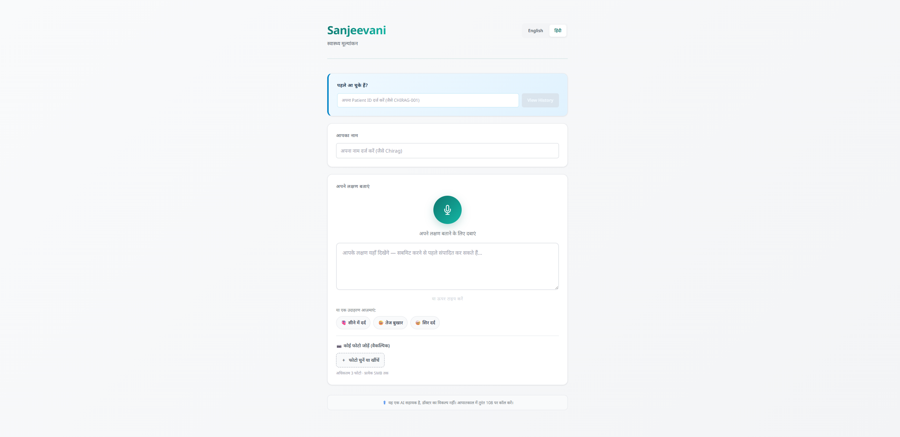
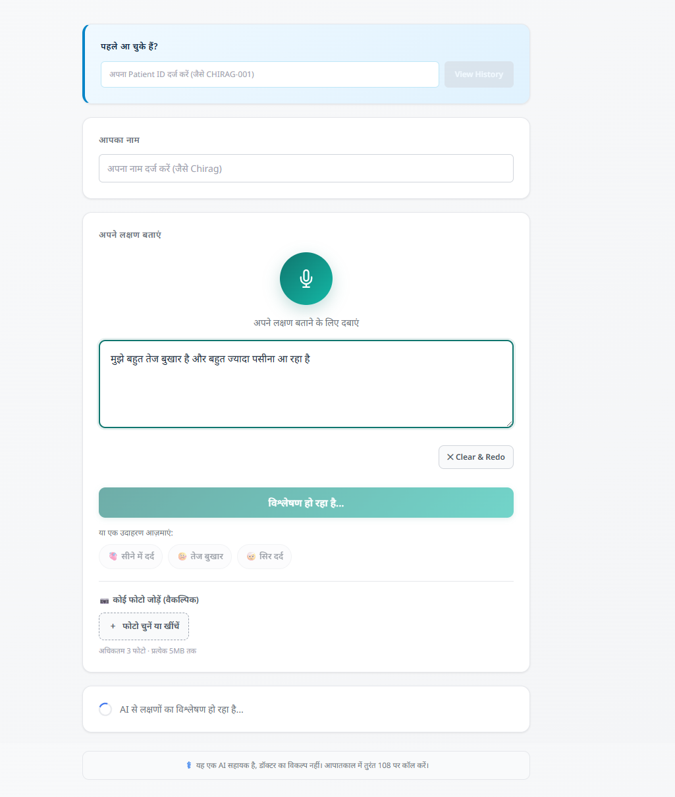
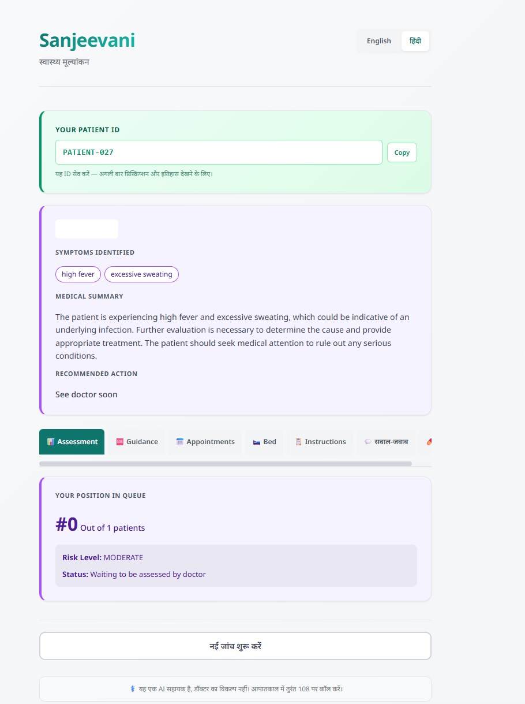
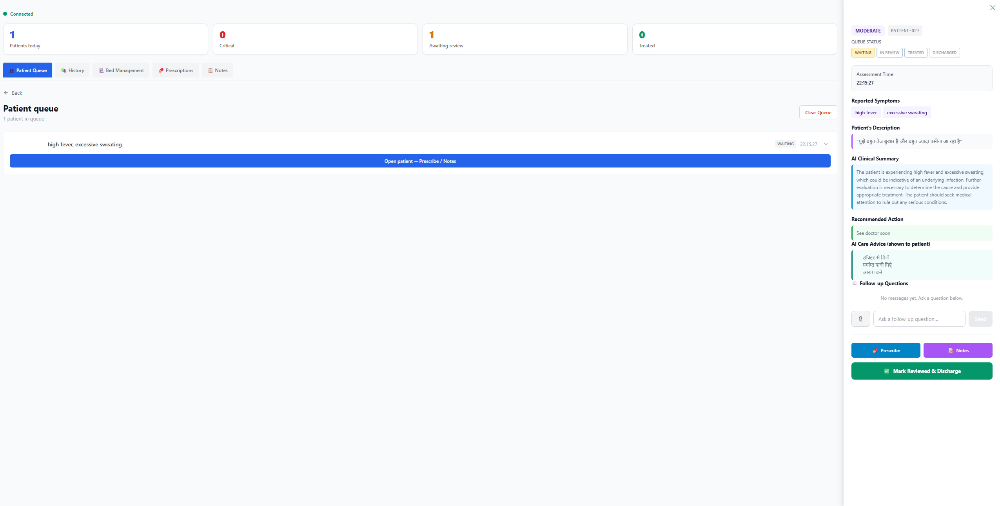
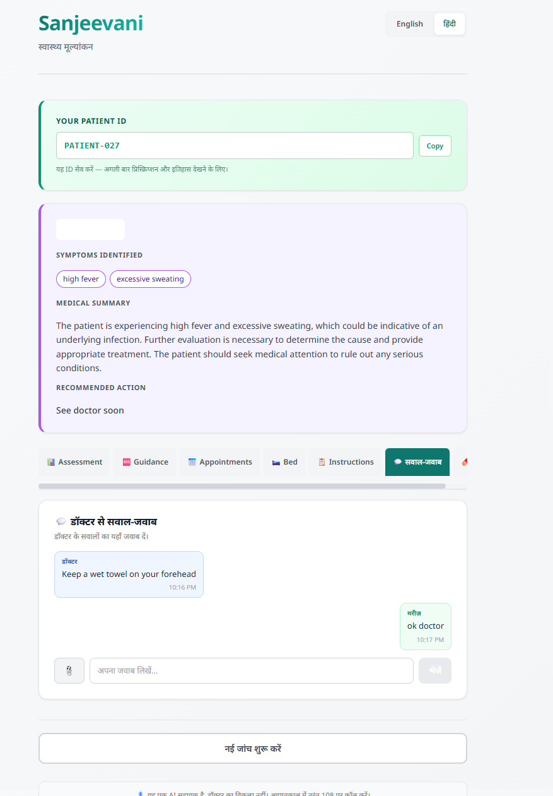
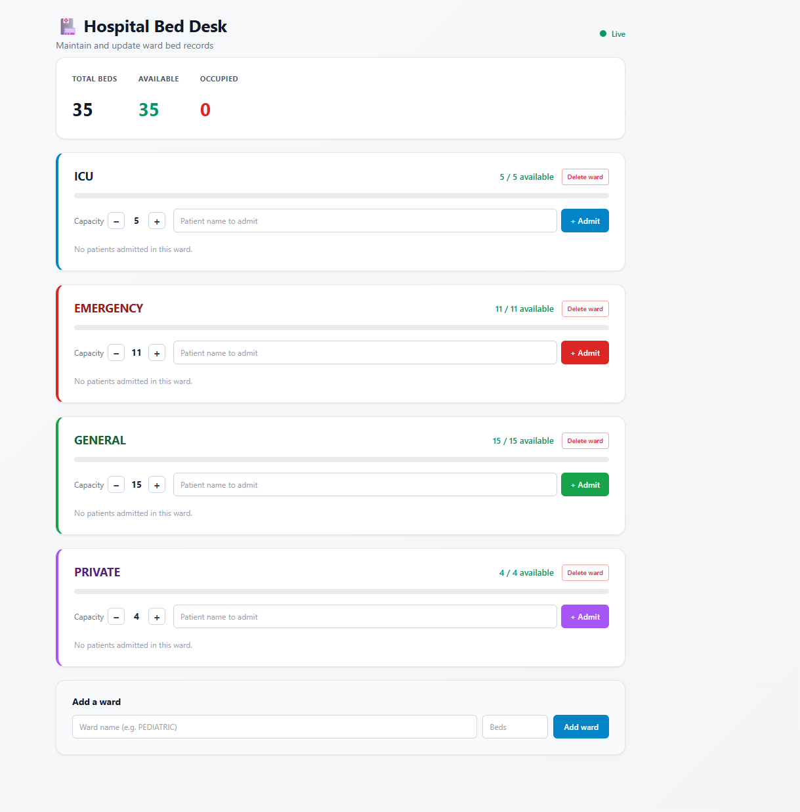

# Sanjeevani — AI Healthcare Triage

Emergency departments in India routinely triage patients at the front desk using verbal intake with no structured risk scoring. The result is that critical patients can wait behind lower-priority cases, and doctors receive no alert until the patient reaches them. Sanjeevani is a prototype that replaces that verbal intake step with a structured AI triage loop: patients describe symptoms by voice or text, the system classifies risk, queues the patient, and pushes real-time alerts to a doctor dashboard — with critical cases surfaced to the top.

---

## Screenshots

**Patient intake — Hindi UI with voice/text symptom input**



**Symptom analysis in progress — transcript editable before submission**



**Triage result — risk classification and AI clinical summary**



**Doctor dashboard — live queue with patient detail panel, AI care advice in Hindi**



**Doctor–patient follow-up Q&A over WebSocket**



**Hospital Bed Desk — live ward management**



---

## Architecture

```
Patient (browser)
    |
    | POST /triage  (REST)
    v
FastAPI (backend/main.py)
    |-- triage.py        LLM provider chain + keyword fallback
    |-- websocket.py     ConnectionManager (broadcast + queue replay)
    |-- data/            JSON persistence (queue, prescriptions, notes, followups)
    |
    | WebSocket /ws/doctor
    v
Doctor Dashboard (browser)
```

**Triage flow.** `POST /triage` accepts a free-text transcript. `analyze_transcript()` in `triage.py` tries providers in order: Groq (llama-3.3-70b) → OpenRouter (free model pool) → keyword-based fallback. The keyword fallback is not a last resort that silently degrades; it runs a negation-aware substring scan with Hindi/Hinglish/Devanagari patterns and is accurate enough to be the primary path in no-key environments. A safety net always runs: if the keyword detector flags an emergency the LLM missed, the result is escalated to CRITICAL. The response is appended to the in-memory queue, written to disk, and broadcast to all connected doctor clients over WebSocket.

**WebSocket queue replay.** When a doctor client connects to `/ws/doctor`, the server immediately streams the full current queue before the client enters the live event loop. This means a doctor who refreshes their tab or opens a second monitor gets a consistent view of all patients queued since server start, not just patients who arrived after their connection. The implementation is in `main.py` lines 152–157.

**Dual persistence.** The patient queue, prescriptions, notes, and follow-ups live in two places simultaneously: an in-memory Python list (for zero-latency reads and broadcasts) and flat JSON files under `backend/data/` (for restart survival). `_load()` and `_save()` are intentionally thin — no ORM, no migrations. The tradeoff is that concurrent writes are not safe, which is acceptable for a single-process prototype but would require a proper store (Postgres, Redis) under any real load.

**Vite proxy.** In development, Vite proxies `/triage`, `/api`, `/uploads`, and `/ws` to `localhost:8000`. The frontend therefore makes no cross-origin requests and the WebSocket upgrade is handled transparently. In production the FastAPI process serves the built frontend from `backend/static/` via `StaticFiles`, so there is a single origin and no proxy is needed.

---

## Technical Decisions

### WebSocket queue replay on connect

The doctor dashboard needs to show patients who were triaged before the doctor opened their browser. Two options:

1. **REST poll on load, then subscribe for updates.** The client fetches `/api/queue` to seed the list, then connects to WebSocket for live events. This is simple and the typical pattern for read-heavy UIs.

2. **Replay the queue over the WebSocket on connect.** When the doctor connects, the server replays the full queue through the same WebSocket channel before entering the live event loop. The client only has one data path to implement.

This project uses option 2. The reason is that the frontend already normalizes every incoming WebSocket frame into the queue state — emergency alerts, status updates, prescriptions, follow-ups — so adding a second REST-based seed path would require duplicating that normalization in two places. Funneling everything through one channel keeps the client code simpler.

The tradeoff is scale: replaying the full queue on every connect is O(n) in queue size. For a queue that grows without bound and a doctor dashboard that reconnects frequently (mobile network, tab hibernation), this degrades. The right fix at that point is pagination — either a `GET /api/queue?after=<cursor>` REST endpoint that seeds the client, or sending only the delta since a client-supplied cursor at connect time.

---

## Tech Stack

| Layer | Technology |
|---|---|
| Frontend | React, Vite, Web Speech API |
| Backend | FastAPI, Python 3.11+ |
| LLM (primary) | Groq — llama-3.3-70b-versatile |
| LLM (fallback) | OpenRouter free model pool |
| Triage fallback | Keyword matching (English, Hindi, Hinglish, Devanagari) |
| Persistence | In-memory + JSON files |
| Real-time | WebSocket (FastAPI native) |

---

## Known Limitations

**Patient history is localStorage-only.** The patient ID is generated and stored in the browser. There is no server-side patient record lookup. Clearing browser storage loses history.

**Appointments are mock.** The appointment booking UI generates a confirmation number client-side. No backend stores or validates appointment slots.

**Triage quality degrades without an API key.** Without `GROQ_API_KEY` or `OPENROUTER_API_KEY`, triage falls back to keyword matching. The keyword list covers common Hindi/Hinglish patterns and includes negation detection, but it cannot reason about symptom combinations or context the way an LLM can.

**No real authentication.** The doctor dashboard and hospital bed desk have static PIN gates (client-side only, not server-enforced). Anyone who knows the PIN — or reads the source — can view the queue and write prescriptions. This is a prototype constraint, not an oversight.

**Single-process only.** The in-memory queue and `ConnectionManager` are process-local. Running multiple uvicorn workers would give each worker its own queue. A shared store (Redis pub/sub for WebSocket fan-out, Postgres for persistence) would be needed to scale horizontally.

---

## Setup

```bash
git clone https://github.com/chiragduhoon/sanjeevani.git
cd sanjeevani/backend
pip install -r requirements.txt
export GROQ_API_KEY=your_key   # optional; falls back to keyword triage without it
python main.py                 # backend at http://localhost:8000
```

In a second terminal:

```bash
cd sanjeevani/frontend
npm install && npm run dev     # frontend at http://localhost:5173
```

Open `http://localhost:5173` (patient view) and `http://localhost:5173/doctor` (doctor dashboard) in separate tabs.

---

## Author

Chirag Duhoon — B.Tech Artificial Intelligence, Bennett University  
GitHub: [chiragduhoon](https://github.com/chiragduhoon)
